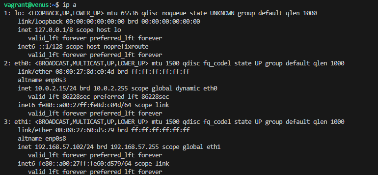
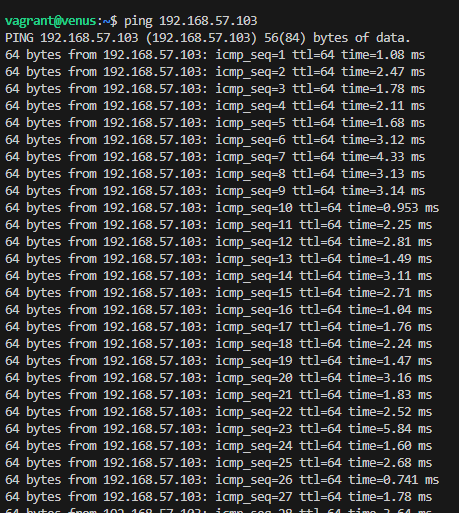

# Práctica DNS

## 1. Instrucciones para ejecutar

Este repositorio contiene los archivos necesarios para la creación de máquinas virtuales utilizando Vagrant.

### Instrucciones para ejecutar

1. Clona este repositorio:

2. Inicia las máquinas virtuales con Vagrant:

3. Verifica que Apache se haya instalado correctamente accediendo a la dirección IP de la máquina virtual.

### Transferencia de Zona


### Requisitos

- [Vagrant](https://www.vagrantup.com/downloads)
- [VirtualBox](https://www.virtualbox.org/wiki/Downloads)

### Instalacion 

He creado los diferentes archivos que pide la practica:

`Vagrantfile:` Este archivo se utiliza para configurar máquinas virtuales.
`README.md:` Es un archivo de Markdown que contiene una descripción del proyecto.
`LICENSE:` Este archivo define los términos legales bajo los cuales el proyecto puede ser utilizado, modificado o distribuido.
`.gitignore:` Es un archivo utilizado en proyectos gestionados con Git para especificar qué archivos o directorios deben ser ignorados por el sistema de control de versiones.   

### Licencia

Este proyecto está bajo la licencia MIT.

## 2. Datos del problema

### 2.1 Red
Las dos máquinas virtuales están configuradas en la red privada `192.168.57.0/24`. A cada máquina se le asigna una IP fija dentro de este rango, y se les configura un nombre FQDN (Fully Qualified Domain Name).

### 2.2 Equipos

| Equipo               | FQDN                | IP              |
|----------------------|---------------------|-----------------|
| Debian texto         | venus.sistema.test   | 192.168.57.102  |
| Debian texto         | tierra.sistema.test  | 192.168.57.103  |

### Cómo levantar las máquinas

Para levantar las máquinas, sigue estos pasos:

1. Clona este repositorio:
   ```bash
   git clone https://github.com/Enriquechis13/practica-DNS.git
   cd practica-DNS
    ```
## Inicio Venus y Tierra




## 3. Datos del DNS

El proyecto está basado en la configuración de un servidor DNS usando **Bind9**. Se ha configurado una arquitectura maestro-esclavo:

- **Tierra (maestro)**: Controla la zona directa e inversa.
- **Venus (esclavo)**: Sincroniza sus registros DNS con `tierra`.

### Configuraciones principales:

1. **IPv4 activado solamente:** En la configuración de Bind, se fuerza el uso de solo IPv4 añadiendo `OPTIONS="-u bind -4"` en `/etc/default/named`.

2. **DNSSEC habilitado:** La opción `dnssec-validation` está establecida en `yes`.

3. **Configuración de ACL para Consultas Recursivas**

Para permitir que el servidor DNS acepte consultas recursivas solo desde ciertas redes, sigue estos pasos:

 Abre el archivo de configuración de Bind9:
```bash
   sudo nano /etc/bind/named.conf.options

   acl "allowed_clients" {
    127.0.0.0/8;
    192.168.57.0/24;
    };

    options {
        directory "/var/cache/bind";

        dnssec-validation yes;
        recursion yes;
        allow-recursion { "allowed_clients"; };

        auth-nxdomain no;
        listen-on-v6 { any; }; 
    };
```

4. **Servidor maestro:** `tierra.sistema.test` tiene autoridad sobre la zona directa e inversa.

5. **Servidor esclavo:** `venus.sistema.test` sincroniza su configuración con `tierra.sistema.test` y realiza consultas al maestro para obtener los registros DNS.

Asegúrate de crear los archivos de zona necesarios para el servidor maestro (`tierra.sistema.test`):

6. **Tiempo:** `venus.sistema.test` sincroniza su configuración con `tierra.sistema.test` y realiza consultas al maestro para obtener los registros DNS.

```bash
    acl "allowed_clients" {
    127.0.0.0/8;
    192.168.57.0/24;
};

options {
    directory "/var/cache/bind";

    dnssec-validation yes;
    recursion yes;
    allow-recursion { "allowed_clients"; };

    auth-nxdomain no;
    listen-on-v6 { any; }; 

    negative-cache-timeout 7200; 
};
```

7. **Reenviar consultas no autorizadas:** Debes modificar la configuración del servidor DNS en el servidor maestro (`tierra`). A continuación, se detallan los cambios que necesitas realizar en el `Vagrantfile`, específicamente en la sección del servidor maestro.

8. **Alias de DNS:** Se añaden los registros `ns1` y `ns2` en el archivo de zona del servidor maestro (`/etc/bind/db.sistema.test`):

    ***a.*** `ns1 IN A 192.168.57.103;` — Define `ns1.sistema.test` como un alias para tierra.
    
    ***b.*** `ns2 IN A 192.168.57.102;` — Define `ns2.sistema.test` como un alias para venus.

*Parte 9 y 10 no realizada por no tener `marte.sistema.test`*

## 4. Comprobación

Para la comprobacion he utilizado como dice el ejercicio el comando `dig` y `nslookup`:

1.  **Resolver los registros tipo A:** 

**dig**

Comando para verificar el registro tipo A de `venus.sistema.test:`

```bash 
dig @192.168.57.103 venus.sistema.test A
```

Comando para verificar el registro tipo A de `tierra.sistema.test:`

```bash 
dig @192.168.57.103 tierra.sistema.test A
```

**nslookup**

Comando para verificar el registro tipo A de `venus.sistema.test:`

```bash
nslookup venus.sistema.test 192.168.57.103
```

Comando para verificar el registro tipo A de `tierra.sistema.test:`

```bash
nslookup tierra.sistema.test 192.168.57.103
```

2.  **Resolver de forma inversa sus direcciones IP:** 

**dig**

Ejecuta el siguiente comando en `venus` para comprobar la resolución inversa de `192.168.57.102` (IP de `venus`):

```bash
dig -x 192.168.57.102 @192.168.57.103
```

Ejecuta el siguiente comando en `tierra` para comprobar la resolución inversa de `192.168.57.103` (IP de `tierra`):

```bash
dig -x 192.168.57.103 @192.168.57.103
```

**nslookup**

Ejecuta el siguiente comando en `venus` para comprobar la resolución inversa de `192.168.57.102` (IP de `venus`):

```bash
nslookup 192.168.57.102 192.168.57.103
```

Ejecuta el siguiente comando en `tierra` para comprobar la resolución inversa de `192.168.57.103` (IP de `tierra`):

```bash
nslookup 192.168.57.103 192.168.57.103
```

3.  **Resolver los alias ns1.sistema.test y ns2.sistema.test:** 

He actualizado el contenido de `/etc/bind/db.sistema.test:`

```bash
$TTL    86400
@       IN      SOA     tierra.sistema.test. admin.sistema.test. (
                          2023102401 ; Serial
                          3600       ; Refresh
                          1800       ; Retry
                          604800     ; Expire
                          86400 )    ; Negative Cache TTL
;

; Registros de nombre de servidor
@       IN      NS      ns1.sistema.test.
@       IN      NS      ns2.sistema.test.

; Direcciones IP de los servidores de nombres
ns1     IN      A       192.168.57.103
ns2     IN      A       192.168.57.102

; Registros adicionales
venus   IN      A       192.168.57.102
tierra  IN      A       192.168.57.103
```

Utilizando el terminal he ejecutando los siguientes comandos:

**dig**

```bash 
nslookup ns1.sistema.test 192.168.57.103
nslookup ns2.sistema.test 192.168.57.103
```

**nslookup**

```bash 
dig ns1.sistema.test @192.168.57.103
dig ns2.sistema.test @192.168.57.103
```

4. **Consulta para saber los servidores NS de sistema.test:**

He obtenido los servidores de nombres (NS) para el dominio `sistema.test:`

**dig**

```bash
dig NS sistema.test @tierra.sistema.test
```

**nslookup**

```bash
nslookup -type=NS sistema.test tierra.sistema.test
```

5. **Consulta para saber los servidores MX de sistema.test:**

He consultado los servidores de correo (MX) del dominio `sistema.test:`

**dig**

```bash
dig MX sistema.test @tierra.sistema.test
```

**nslookup**

```bash
nslookup -type=MX sistema.test tierra.sistema.test
```

6. **Comprueba que se ha realizado la transferencia de la zona entre el servidor DNS maestro y el esclavo. Revisa los logs o realiza una consulta del registro AXFR:**

Para verificar que se ha realizado la transferencia de zona entre el servidor DNS maestro (`tierra.sistema.test`) y el esclavo (`venus.sistema.test`), realiza una consulta AXFR. 

**dig**

```bash
dig @192.168.57.103 sistema.test AXFR
```

**nslookup**

```bash
nslookup
> server 192.168.57.103
> ls -d sistema.test       
```

7. **Consulta que tanto maestro como esclavo pueden contestar a las mismas preguntas:**

Para comprobar que tanto el servidor maestro (`tierra`) como el esclavo (`venus`) pueden responder a las mismas consultas DNS.

**nslookup - Tierra**

```bash
nslookup venus.sistema.test 192.168.57.103
```

```bash
nslookup -type=NS sistema.test 192.168.57.103
```

```bash
nslookup -type=MX sistema.test 192.168.57.103
```

**nslookup - Venus** 

```bash
nslookup venus.sistema.test 192.168.57.102
```

```bash
nslookup -type=NS sistema.test 192.168.57.102
```

```bash
nslookup -type=MX sistema.test 192.168.57.102
```