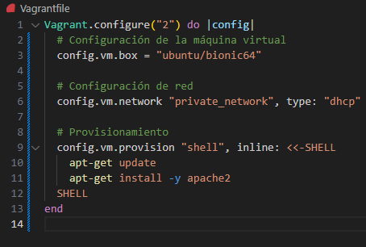

# Práctica DNS

## 1. Instrucciones para ejecutar

Este repositorio contiene los archivos necesarios para la creación de máquinas virtuales utilizando Vagrant.

## Instrucciones para ejecutar

1. Clona este repositorio:

2. Inicia las máquinas virtuales con Vagrant:

3. Verifica que Apache se haya instalado correctamente accediendo a la dirección IP de la máquina virtual.

## Transferencia de Zona



## Requisitos

- [Vagrant](https://www.vagrantup.com/downloads)
- [VirtualBox](https://www.virtualbox.org/wiki/Downloads)

## Licencia

Este proyecto está bajo la licencia MIT.

## 2. Datos del problema

### 2.1 Red
Las dos máquinas virtuales están configuradas en la red privada `192.168.57.0/24`. A cada máquina se le asigna una IP fija dentro de este rango, y se les configura un nombre FQDN (Fully Qualified Domain Name).

### 2.2 Equipos

| Equipo               | FQDN                | IP              |
|----------------------|---------------------|-----------------|
| Debian texto         | venus.sistema.test   | 192.168.57.102  |
| Debian texto         | tierra.sistema.test  | 192.168.57.103  |

### Cómo levantar las máquinas

Para levantar las máquinas, sigue estos pasos:

1. Clona este repositorio:
   ```bash
   git clone https://github.com/Enriquechis13/practica-DNS.git
   cd practica-DNS
    ```
## Inicio Venus y Tierra


## 3. Datos del DNS

